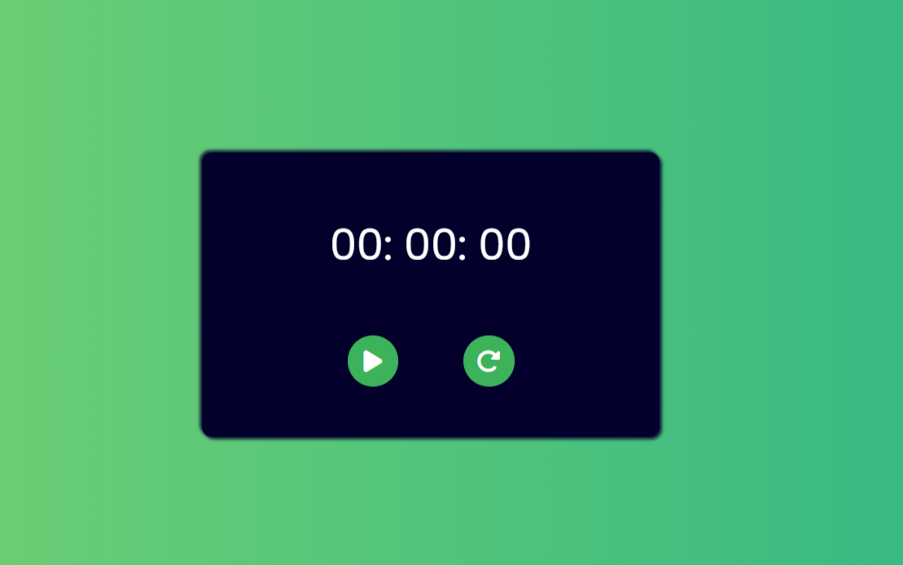

# Stopwatch Website

This is a simple stopwatch website created using vanilla JS, HTML and CSS.

## Features

- Start/stop the stopwatch.
- Reset the stopwatch to zero.

## How to use

1. Open the website on your browser.
2. Click the "Start" button to start the stopwatch.
3. Click the "Stop" button to stop the stopwatch.
4. Click the "Reset" button to reset the stopwatch to zero.

## Technologies used

- Vanilla JS
- HTML
- CSS

## Credits

This project was created by [Aditya Gupta](https://github.com/imaditya05).

## License

This project is licensed under the [MIT License](https://opensource.org/licenses/MIT).
